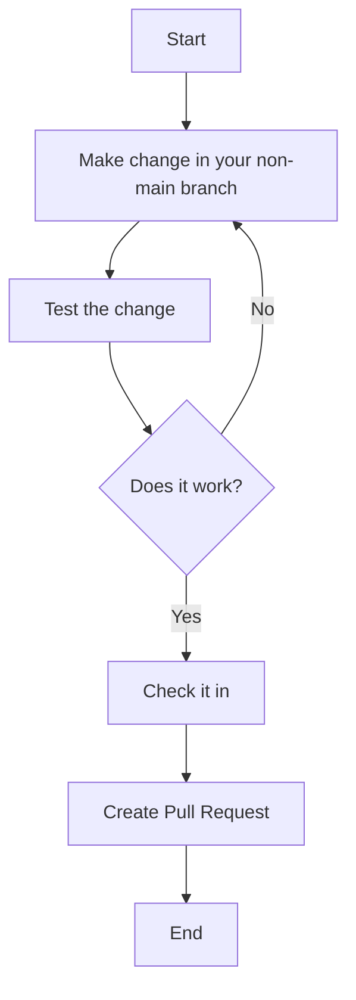

# SideScroller Demo in Unreal Engine 5.2

Just messing around with Unreal Engine and C++ to create a Mario-like game.


## Contributing / Collaborating



### Installing Unreal Editor (Pre-req)

1. Download Epic Games Launcher for the inter-webs
2. Will have to sign up for an account
3. download and install Unreal Engine (for this project, we use 5.2.1)

### Getting Started

1. Clone the repo
2. Download IDE (Rider or VSCode)
3. Open the repo in the IDE
4. test build

### Making Changes

1. Add changes to a branch other than `main` (good practice to add a task number in the branch title)
2. once tested and working, make a pull request to main (see flowchart above)

### Compile the changes

Each time you want to test a change, the code must be compiled.

a. Compile the code (`ctrl+alt+F11`)  
b. Use the little `tetris-icon` button at the bottom-right in unreal editor  

## Testing

Testing can be done one of three ways:

### 1. Run it in the Editor

1. crank up UE5 and direct it to the project
2. Hit the little `play` button to run the game

### 2. Package it

#### in editor:

using the packaging selections (`development` for quick packing) in UE (Unreal Editor), choose the proper platform for your dev machine.

#### from powershell command line:

*without compile*
```shell
F:\UE_5.2\Engine\Build\BatchFiles\RunUAT.bat BuildCookRun -project="C:\Users\A-A-Ron\git\SideScroller\SideScroller.uproject" -noP4 -platform=Win64 -clientconfig=Development -serverconfig=Development -cook -allmaps -NoCompile -stage -pak -archive -archivedirectory="C:\Users\A-A-Ron\Desktop\Games\sidescroller"
```

*with compile*
```shell
F:\UE_5.2\Engine\Build\BatchFiles\RunUAT.bat BuildCookRun -project="C:\Users\A-A-Ron\git\SideScroller\SideScroller.uproject" -noP4 -platform=Win64 -clientconfig=Development -serverconfig=Development -cook -allmaps -build -stage -pak -archive -archivedirectory="C:\Users\A-A-Ron\Desktop\Games\sidescroller"
```

##### Run packaged game from powershell (3 player game)

copy package to 2 more locations (may have to create the `sidescroller1` and `sidescroller2` locations)
```shell
cp -R C:\Users\A-A-Ron\Desktop\Games\sidescroller\Windows C:\Users\A-A-Ron\Desktop\Games\sidescroller1\;
cp -R C:\Users\A-A-Ron\Desktop\Games\sidescroller\Windows C:\Users\A-A-Ron\Desktop\Games\sidescroller2\;
```

run all three executables
```shell
C:\Users\A-A-Ron\Desktop\Games\sidescroller\Windows\SideScroller.exe;
C:\Users\A-A-Ron\Desktop\Games\sidescroller1\Windows\SideScroller.exe;
C:\Users\A-A-Ron\Desktop\Games\sidescroller2\Windows\SideScroller.exe;
```

remove the packaged game files from all three locations
```shell
rmdir C:\Users\A-A-Ron\Desktop\Games\sidescroller\Windows;
rmdir C:\Users\A-A-Ron\Desktop\Games\sidescroller1\Windows;
rmdir C:\Users\A-A-Ron\Desktop\Games\sidescroller2\Windows;
```

### 3. Run it from command line

#### example commands:

##### WINDOWS (PowerShell)
```shell
& F:\UE_5.2\Engine\Binaries\Win64\UnrealEditor.exe C:\Users\A-A-Ron\git\SideScroller\SideScroller.uproject /Game/Maps/Map_MainMenu -game -log -v -windowed resx=1280 resy=720
```
##### MacOS (Terminal)
```shell
"/Users/Shared/Epic Games/UE_5.2/Engine/Binaries/Mac/UnrealEditor.app/Contents/MacOS/UnrealEditor" $HOME/git/SideScroller/SideScroller.uproject  /Game/Maps/Map_MainMenu -game -log -v -windowed resx=1280 resy=720 &
```

---

#### Cleaning up references and moves in the editor 

useful when trying to rename a BP and unreal tells you "there is already a BP with that name", but you know there isn't anymore  
See the following link: https://docs.unrealengine.com/4.26/en-US/ProductionPipelines/Redirectors/

```shell
& F:\UE_5.2\Engine\Binaries\Win64\UnrealEditor.exe C:\Users\A-A-Ron\git\SideScroller\SideScroller.uproject -run=ResavePackages -fixupredirects -autocheckout -projectonly -unattended
```

---

### Crash Reports (this has the potential to save you hours [if not days]!!)

If unreal crashes and it isn't apparent as to why, the quickest way to troubleshoot is...

1. go to the following directory (or similar)  
   `%LocalAppData%\UnrealEngine\5.2\Saved\Crashes`
2. sort by date
3. look for the folder with a date nearest the crash time
4. read the last entries in the `*.log` file

## Asset Pack used

https://drive.google.com/file/d/1YFvWsiDKBotM7sMRIEvBJmszVkTc90zK/view
