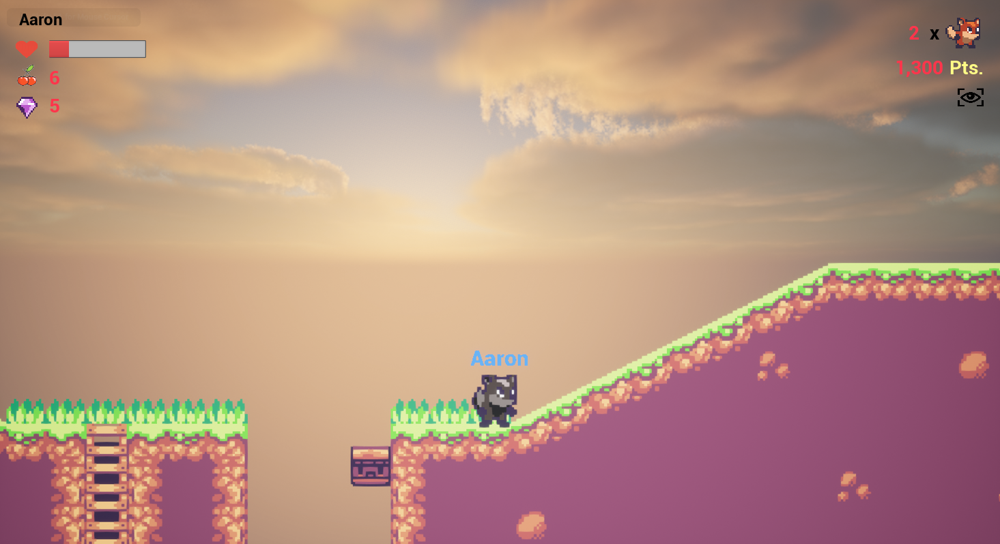

# SideScroller Demo in Unreal Engine 5.2

Just messing around with Unreal Engine and C++ to create a Mario-like game.



## Contributing / Collaborating


### Installing Unreal Editor (Pre-req)

1. Download Epic Games Launcher for the inter-webs
2. Will have to sign up for an account
3. download and install Unreal Engine (for this project, we use 5.2.1)

### Getting Started

1. Clone the repo
2. Download IDE (Rider or VSCode)
3. Open the repo in the IDE
4. test build

### Making Changes

1. Add changes to a branch other than `main` (good practice to add a task number in the branch title)
2. once tested and working, make a pull request to main (see flowchart above)

### Compile the changes

Each time you want to test a change, the code must be compiled.

a. Compile the code (`ctrl+alt+F11`)  
b. Use the little `tetris-icon` button at the bottom-right in unreal editor  

## Testing

Testing can be done one of three ways:

### 1. Run it in the Editor

1. crank up UE5 and direct it to the project
2. Hit the little `play` button to run the game

### 2. Package it

using the packaging selections (`deleopment`` for quick packing) in UE (Unreal Editor), choose the proper platform for your dev machine.

### 3. Run it in PowerShell

example command:
```shell
 & F:\UE_5.2\Engine\Binaries\Win64\UnrealEditor.exe C:\Users\A-A-Ron\git\SideScroller\SideScroller.uproject /Game/Maps/Map_MainMenu -game -log -v -windowed resx=1280 resy=720
```

---

## Asset Pack used

https://drive.google.com/file/d/1YFvWsiDKBotM7sMRIEvBJmszVkTc90zK/view
